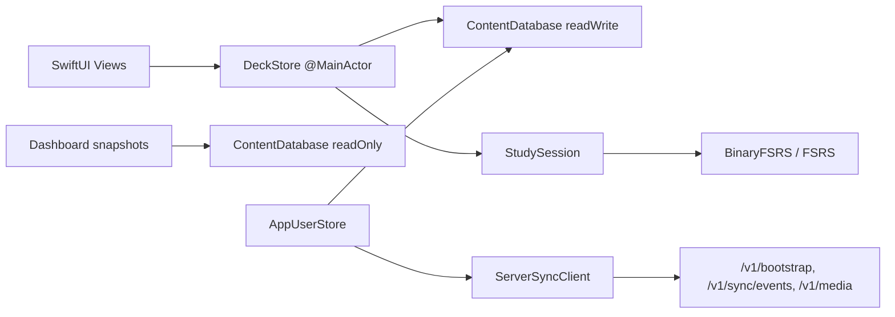

# Аудит: баги клиента и интеграция с сервером

**Дата аудита:** 2026-06-01  
**Область:** `client/Words Trainer` (iOS), интеграция с `server/`  
**Режим:** read-only, код не менялся  

**Связанные документы:**
- `docs/code-review-2026-06-04.md`
- `docs/sync-strategy-review.md`
- `docs/sync-strategy-decision.md`
- `audit/2026-06-06-performance-db-offmain.md`

---

## Вердикт

Архитектура зрелая: один SQLite на пользователя, outbox → `POST /v1/sync/events`, LWW для прогресса, idempotent `study_reviews`, WAL + read-only снапшоты для дашборда, тесты в `SPMTest`.

Критичных дыр в транспорте (auth, batch ACK, day rollover) нет. Основные риски — **локальная семантика учёба/практики**, **reconciliation прогресса и медиа после sync**, **тихие ошибки сохранения**.

---

## Архитектура (кратко)



**Поток учёба:** Review → `StudySession.advanceAfterReview` → `DeckStore.saveProgress` / `saveStudyReview` → SQLite → outbox → upload.

**Поток sync:** `AppUserStore.refreshFromServer()` → pre-upload outbox → `GET /v1/bootstrap` → `importServerBootstrap` → cache media → post-upload outbox.

---

## Critical — вероятная поломка для пользователя

### ⚠️ OPEN · 1. Прогресс может не сохраниться, UI молчит

**Файлы:** `Words Trainer/Views/StudySessionView.swift` (~213–217)

`submit()` оборачивает `session.advanceAfterReview(...)` в `do/catch` и глотает все ошибки (`// MVP: ignore scheduling errors in UI`).

**Почему баг:** при ошибке БД/FSRS карточка в UI уже «ушла», а `saveProgress` / `saveStudyReview` не записались. Пользователь думает, что учился; SRS и sync расходятся.

**Направление фикса:** не продвигать UI до успешного save; alert/toast при ошибке; опционально rollback очереди.

---

### ⚠️ OPEN · 2. Смена пользователя при открытой сессии → запись под чужим user_id

**Файлы:**
- `Words Trainer/Services/DeckStore.swift` (~52–66) — `DeckStore` привязан к `userID` при создании
- `Words Trainer/Views/DeckListView.swift` (~38–41)
- `Words Trainer/Views/DashboardViews.swift` (~111–115)

При смене `userStore.selectedUserID` родитель сбрасывает `store = nil`, но уже открытые `StudySessionView` / `DeckDetailView` держат старый `DeckStore`.

**Почему баг:** отзывы могут записаться не тому пользователю в общей БД.

**Направление фикса:** dismiss study/detail при смене user; assert `store.currentUserID == userStore.selectedUserID` перед save; pop navigation stack.

---

### ⚠️ OPEN · 3. Одна битая строка FSRS ломает всю колоду

**Файл:** `Words Trainer/Services/ContentDatabase.swift` — `progressMap(deckID:)` (~398–422)

`JSONDecoder().decode(Card.self, from: data)` бросает на первой битой строке → весь `progressMap` падает.

**Почему баг:** одна испорченная `fsrs_data` (миграция, ручное редактирование, skew версии FSRS) блокирует stats, queue building и старт учёбы для колоды.

**Направление фикса:** per-row decode с skip + log; repair → `CardProgress.newCard`; UI «сбросить прогресс карточки».

---

## High — неверное поведение / риск данных

### ⚠️ OPEN · 4. «Практика» в matching всё равно портит FSRS

**Файлы:**
- `Words Trainer/SRS/StudySession.swift` (~13–15) — комментарий в коде
- `Words Trainer/Views/MatchingColumnsStudyView.swift` (~331–335)
- `Words Trainer/Services/DeckStore.swift` — `weakCardsMatchingSession`, `TodayStudySessionBuilder` (`savesProgress: false`)

Режимы «Забытые слова» и «практика сегодня» не пишут review events (`savesProgress: false`), но ошибки в колонках вызывают `store.saveProgress` напрямую через `recordIncorrectMatchingPair`.

**Почему баг:** пользователь воспринимает режим как «чистую игру», а SRS меняется на wrong tap.

**Направление фикса:** gate `saveProgress` на `session.savesProgress`; или явно документировать в UI «ошибки влияют на расписание».

---

### ⚠️ OPEN · 5. Matching не даёт «хороших» отзывов FSRS

**Файлы:** `StudySession.swift`, `MatchingColumnsStudyView.swift`

Верные пары только `removeMatchedPair`; FSRS обновляется только на `.incorrect`.

**Почему баг:** «Колонки» как учебный режим штрафуют без scheduling benefit на correct match.

**Направление фикса:** продуктовое решение — либо non-SRS game, либо `.good` на correct (throttled once per card per session).

---

### ⚠️ OPEN · 6. Сброс прогресса на сервере не доезжает на клиент

**Файлы:**
- `Words Trainer/Services/AppUserStore.swift` (~214)
- `Words Trainer/Services/ContentDatabase.swift` — `deleteSyncedProgressMissingFromServerSnapshot` (~1761–1787)

```swift
progressSnapshotIsComplete: bootstrapDeviceID == nil && bootstrapSinceRevision == "0"
```

`deviceID()` создаётся при первом открытии БД → `bootstrapDeviceID` уже не `nil` → флаг **почти всегда false** → `deleteSyncedProgressMissingFromServerSnapshot` не вызывается.

**Почему баг:** противоречит `docs/code-review-2026-06-04.md` («Reset/удаление прогресса доезжает»). После admin reset на сервере локальные synced-строки могут остаться → ghost cards в очереди.

**Направление фикса:** отдельный metadata-флаг (`has_completed_initial_sync`); enable reconcile при `sinceRevision == "0"` или периодически.

---

### ⚠️ OPEN · 7. Кэш версии колоды + пропавшие медиа = без самовосстановления

**Файлы:**
- `ContentDatabase.swift` — `cachedDeckVersionIDs`, `markContentVersionsImported`
- `AppUserStore.swift` — `cacheMedia` (~332+)
- `server/src/routes/sync.ts` — media query excludes cached versions

Flow:
1. Контент импортируется, `content_version_id` помечается cached.
2. Медиа качаются **после** commit.
3. Следующий bootstrap шлёт `X-FlashGame-Cached-Deck-Version-Ids` → сервер не отдаёт media metadata.
4. Удалённые с диска файлы не перекачиваются (`guard let media = mediaObjects[mediaID]`).

**Почему баг:** битые картинки/аудио до ручного сброса кэша или wipe app data. Описано также в `docs/sync-strategy-review.md` §2.

**Направление фикса:** re-fetch media при missing files; не mark version cached until media succeeds; «force full refresh».

---

### ⚠️ OPEN · 8. Outbox: practice/progress/matching vs study reviews

**Файл:** `ContentDatabase.swift`

| Outbox type | Фильтр active assignment |
|-------------|--------------------------|
| `pendingReviewEvents` | ❌ нет (исправлено) |
| `pendingPracticeReviews` | ✅ да (~1047–1052) |
| `pendingProgressItems` | ✅ да (~1103–1107) |
| `pendingMatchingRecords` | ✅ да (~1154–1157) |

**Почему баг:** если колоду заarchivили на сервере offline, reviews уедут, practice/progress/matching — могут зависнуть навсегда.

**Направление фикса:** выровнять фильтры с `pendingReviewEvents`.

---

### ⚠️ OPEN · 9. Старт сессии без обратной связи

**Файлы:**
- `Words Trainer/Views/DeckListView.swift` (~1093–1101)
- `Words Trainer/Views/DashboardViews.swift` — `TodayDeckModesView.start`, `StatisticsView.startWeakGame`

`session = try? store.start…()` — failure → `session = nil`, `showStudy = false`, без alert.

**Почему баг:** кнопка «мёртвая» при пустой очереди или ошибке БД. В `TodayAllDecksModesView` alert есть — поведение непоследовательное.

**Направление фикса:** единый alert pattern; различать empty queue vs DB error.

---

### ⚠️ OPEN · 10. Upload outbox не атомарен с HTTP

**Файл:** `AppUserStore.swift` — `uploadPendingEvents` (~299–309)

HTTP 200 → затем `markServerSyncBatchUploaded`. Краш между шагами → retry → duplicate server events (reviews idempotent по `id`; progress/matching — риск конфликтов).

**Направление фикса:** outbox state machine; mark pending → uploaded в одной транзакции с idempotent server keys.

---

### ⚠️ OPEN · 11. Pre-bootstrap upload failure ignored

**Файл:** `AppUserStore.swift` (~174–182)

Pending upload errors логируются, bootstrap продолжается.

**Почему баг:** локальный unsynced progress может расходиться с server snapshot при import.

**Направление фикса:** block bootstrap при non-empty outbox + upload failure; или explicit merge/conflict UI.

---

## Medium — edge cases и UX

| # | Статус | Проблема | Файлы |
|---|--------|----------|-------|
| 12 | ⚠️ OPEN | **Matching с 0 пар:** `isFinished == true`, UI ждёт `matchingFinished` от анимации; пустой экран без «Готово» | `StudySessionView`, `MatchingColumnsStudyView` |
| 13 | ⚠️ OPEN | **Learning без cap:** все due learning/relearning в очереди; cap только у review/new | `SRS/StudyQueue.swift` |
| 14 | ⚠️ OPEN | **Параллельные reload дашборда** — out-of-order finish → flash старых цифр | `DashboardViews.swift` |
| 15 | ⚠️ OPEN | **`users = serverUsers` до успешного import** — UI/server users vs stale SQLite при failed import | `AppUserStore.swift` (~196–211) |
| 16 | ⚠️ OPEN | **Read-only snapshot vs migration** на апдейте — dashboard может читать pre-migration schema | `ContentDatabase`, `DeckStore` snapshots |
| 17 | 💬 BY DESIGN | **Recall «помню»** не пишет review и не двигает FSRS | `StudySession.swift` |
| 18 | ⚠️ OPEN | **Recall показывает перевод** до ответа — обход memory test, если режим про recall | `RecallStudyView.swift` |
| 19 | ⚠️ OPEN | **Matching: штраф** привязан к `firstSelectedSide` при независимом shuffle колонок | `MatchingColumnsStudyView.swift` |
| 20 | ⚠️ OPEN | **Медиа/ошибки БД** — nil URL, без сообщения пользователю | `resolveMediaURL`, study views |
| 21 | ⚠️ OPEN | **`deckVersionId` в upload всегда nil** — аналитика «на какой версии контента был ответ» теряется | `ContentDatabase.swift` outbox |
| 22 | ⚠️ OPEN | **Matching completion UX:** timer/`isFinished` vs visible board animation desync | `StudySessionView`, `MatchingColumnsStudyView` |
| 23 | ⚠️ OPEN | **Animation tasks** не отменяются on dismiss | `MatchingColumnsStudyView.swift` |
| 24 | ⚠️ OPEN | **`reloadPracticeCount`:** `try?` failure → `practiceCount = 0` | `DashboardViews.swift` |
| 25 | ⚠️ OPEN | **`startAllCardsSession`** bypasses daily limits — может быть intentional | `DeckStore.swift` |
| 26 | ⚠️ OPEN | **Decode errors → generic** «Сервер вернул некорректный ответ» | `ServerSyncClient.swift` |

---

## Client ↔ Server — контракт

| Endpoint | Клиент | Заметки |
|----------|--------|---------|
| `GET /v1/bootstrap?sinceRevision=` | ✅ | Основной pull; cached deck version headers |
| `POST /v1/sync/events` | ✅ | Batch ACK whole batch |
| `GET /v1/media/:id` | ✅ | После bootstrap; `upload_status = ready` |
| `GET /v1/sync/changes` | ❌ | На сервере есть; клиент не использует (by design) |

**Согласовано:**
- LWW прогресса + защита unsynced local (`upsertServerProgress`)
- Day rollover hour = 4 (client SQL, server SQL, `StudyDay.swift`)
- Household bearer auth; constant-time token compare
- `study_reviews` idempotent по `id`

**Дрейф документации:**
- `docs/code-review-2026-06-04.md` помечает reset прогресса как ✅ — находка #6 показывает, что reconcile в prod почти не включается.

---

## Low / tech debt

| # | Находка | Файлы |
|---|---------|-------|
| 27 | `clozeTyping` в enum, UI не подключён (`EmptyView`) | `StudyMode.swift`, `StudySessionView.swift` |
| 28 | Dead path `DeckStore.startSession` (если не удалён) | `DeckStore.swift` |
| 29 | `syncPendingEventsToServer` / `saveUsers` — ошибки глотаются | `AppUserStore.swift` |
| 30 | `StudySessionEngine: @unchecked Sendable` | `StudyQueue.swift` |
| 31 | HTTP 404 message всегда про `/v1/bootstrap` | `ServerSyncClient.swift` |
| 32 | Два пути аватаров: deck `media_objects` vs user app-level folder | `AppUserStore`, `ContentDatabase` |
| 33 | `storage_key` не HTTP URL — только `local_path` после download | `ContentDatabase.resolveMediaReference` |
| 34 | `ContentDatabaseError` не `LocalizedError` | `ContentDatabase.swift` |
| 35 | Duplicate `loadDecks()` в snapshot loaders | `DeckStore.swift` |

---

## Сценарии sync (справочно)

| Сценарий | Поведение |
|----------|-----------|
| Bootstrap network error | `bootstrapState = .failed`; local DB unchanged if import didn't start |
| Pre/post outbox upload failure | Logged; refresh continues; retry on next sync |
| Media download failure | `.loadedWithMediaWarnings`; content already committed |
| Offline study | Local SQLite + outbox; sync on next refresh |
| Stale content cache | Version header skips re-download; **no self-heal** (#7) |
| Server progress reset | Local synced progress may persist (#6) |

---

## Рекомендуемый порядок исправлений

1. Не продвигать UI при failed save (`StudySessionView.submit`) — **#1**
2. Invalidate study on user switch — **#2**
3. Fix `progressSnapshotIsComplete` — **#6**
4. Media/cache recovery — **#7**
5. Align outbox filters — **#8**
6. Unified session-start error handling — **#9**
7. Clarify matching ↔ FSRS for practice modes — **#4, #5**
8. Per-row FSRS decode — **#3**

---

## Сводка

| Severity | Open | Fixed in audit |
|----------|------|----------------|
| Critical | 3 | 0 |
| High | 8 | 0 |
| Medium | 14 (+ 1 by design) | 0 |
| Low | 9 | 0 |

*Аудит не дублирует perf-находки из `audit/2026-06-06-performance-db-offmain.md` — там WAL/read-only snapshots помечены как FIXED.*
